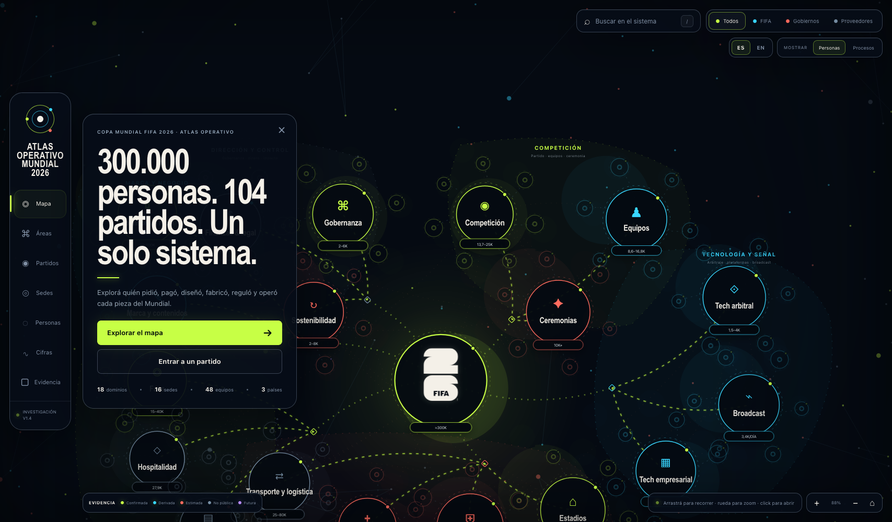

<div align="center">
  
  <h1>Atlas Operativo del Mundial 2026</h1>
  <p>
    
  </p>
  <p>Mapa interactivo de las personas, organizaciones, procesos, países y evidencias detrás de la Copa Mundial de la FIFA 2026.</p>
  <p><strong>Español</strong> · <a href="README_en.md">English</a></p>
  <p>
    <a href="https://tecnomanu.github.io/atlas-world-cup-2026/?lang=es"><strong>Abrir sitio ES</strong></a>
    ·
    <a href="https://tecnomanu.github.io/atlas-world-cup-2026/?lang=en"><strong>Open site EN</strong></a>
  </p>
  <p>
    <a href="https://tecnomanu.github.io/atlas-world-cup-2026/"></a>
    
    <a href="https://github.com/tecnomanu/atlas-world-cup-2026/actions/workflows/pages.yml"></a>
    
  </p>
</div>

## Qué contiene

- 18 dominios operativos.
- Seis macrogrupos visuales que separan dirección, competición, tecnología, ciudad, servicios y negocio.
- Procesos secundarios en órbitas circulares completas alrededor de cada dominio.
- Íconos semánticos y badges métricos flotantes en los nodos principales.
- Más de 100 procesos y objetos navegables.
- 16 sedes explicadas como organizaciones locales distintas.
- Capas FIFA, gobiernos y proveedores privados.
- Proveedores separados de las áreas funcionales, con nombres públicos o advertencias de contrato no revelado.
- Rangos humanos con advertencias contra el doble conteo.
- Personas y organizaciones identificadas públicamente.
- Cadenas de solicitud, presupuesto, compra, permiso, entrega, operación y auditoría.
- Cinco estados de evidencia: confirmada, derivada, estimada, no pública y futura.
- 126 referencias numeradas y 115 URLs únicas en la investigación actual.

## Idiomas / Languages

La app soporta **español** (default) e **inglés**.

- Selector **ES / EN** arriba a la derecha.
- URL: `?lang=en` o `?lang=es`.
- Preferencia guardada en `localStorage`.

Docs de investigación siguen en español por ahora.

English README: [README_en.md](README_en.md).

## Experiencia

El fondo completo es un grafo navegable. Se puede:

- arrastrar y hacer zoom;
- abrir nodos y sus ramas;
- alternar métricas de personas o procesos;
- filtrar por FIFA, gobiernos y proveedores;
- entrar directamente por Áreas, Partidos, Sedes, Personas, Cifras o Evidencia;
- buscar áreas, objetos, organizaciones y ciudades;
- recorrer cada Host City desde país y venue hasta movilidad, dinero y liderazgo.
- compartir una vista mediante parámetros URL para nodo, sede, menú, filtro y métrica.

## Desarrollo local

Requiere Node.js 22 o superior.

```bash
npm ci
npm run dev
```

Verificaciones:

```bash
npm run lint
npm test
```

## GitHub Pages

El repositorio incluye `.github/workflows/pages.yml`. En GitHub:

1. Abrí **Settings → Pages**.
2. Seleccioná **GitHub Actions** como fuente.
3. Hacé push a `main` o ejecutá manualmente el workflow.

El comando utilizado por la acción es:

```bash
npm run build:pages
```

Genera un sitio estático portable en `dist-pages/`.

Sitio publicado: https://tecnomanu.github.io/atlas-world-cup-2026/

## Estructura relevante

```text
app/
  page.tsx                         entrada
  AtlasApp.tsx                    interfaz y navegación i18n
  world-data.ts                   grafo, sedes y contenido (ES)
  i18n/                           locales UI + overlays EN
  research-sources.generated.ts   índice generado de fuentes
docs/
  mundial-2026-mapa-organizacion-investigacion.md
public/
  world-cup-2026-mark.svg
scripts/
  export-pages.mjs                export estático para GitHub Pages
  extract-research-sources.mjs    regenera índice de fuentes
  gen-content-en.mjs              regenera overlays EN del atlas
.github/workflows/
  pages.yml
```

## Actualizar la investigación

Después de editar el documento:

```bash
node scripts/extract-research-sources.mjs \
  docs/mundial-2026-mapa-organizacion-investigacion.md \
  app/research-sources.generated.ts
```

La información posterior a la final está modelada con estado `future`. Debe actualizarse cuando existan reportes oficiales de cierre, auditoría, sostenibilidad e incidentes.

## Metodología

Los rangos de personas no se suman automáticamente. Una misma persona puede aparecer como workforce, proveedor, personal de venue o integrante de una operación pública. El atlas diferencia:

- personas únicas;
- puestos o acreditaciones;
- jornadas-persona;
- cadena global ampliada.

Consultá [la investigación completa](docs/mundial-2026-mapa-organizacion-investigacion.md) para metodología, contradicciones, vacíos y fuentes.

## Aviso

Proyecto independiente de análisis y visualización. No es un sitio oficial de FIFA. Las marcas y emblemas pertenecen a sus titulares. La presencia de una organización en el mapa describe una relación documentada o estimada y no implica patrocinio de este proyecto.
