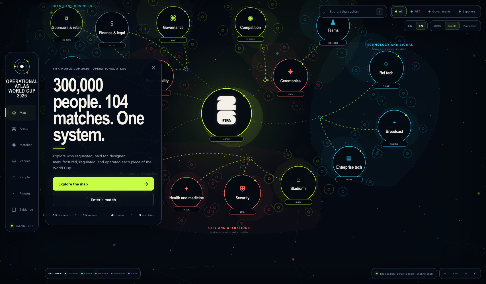

<div align="center">
  
  <h1>2026 World Cup Operational Atlas</h1>
  <p>
    
  </p>
  <p>Interactive map of the people, organizations, processes, countries, and evidence behind the FIFA World Cup 2026.</p>
  <p><a href="README.md">Español</a> · <strong>English</strong></p>
  <p>
    <a href="https://tecnomanu.github.io/atlas-world-cup-2026/?lang=es"><strong>Abrir sitio ES</strong></a>
    ·
    <a href="https://tecnomanu.github.io/atlas-world-cup-2026/?lang=en"><strong>Open site EN</strong></a>
  </p>
  <p>
    <a href="https://tecnomanu.github.io/atlas-world-cup-2026/?lang=en"></a>
    
    <a href="https://github.com/tecnomanu/atlas-world-cup-2026/actions/workflows/pages.yml"></a>
    
  </p>
</div>

## What it includes

- 18 operational domains.
- Six visual macro-groups separating direction, competition, technology, city, services, and business.
- Secondary processes in full circular orbits around each domain.
- Semantic icons and floating metric badges on main nodes.
- More than 100 navigable processes and objects.
- 16 host cities explained as distinct local organizations.
- FIFA, government, and private-supplier layers.
- Suppliers separated from functional areas, with public names or non-disclosed contract warnings.
- Human-range estimates with double-counting warnings.
- Publicly identified people and organizations.
- Request, budget, purchase, permit, delivery, operations, and audit chains.
- Five evidence states: confirmed, derived, estimated, non-public, and future.
- 126 numbered references and 115 unique URLs in the current research set.

## Languages

The app supports **Spanish** (default) and **English**.

- **ES / EN** switch in the top-right.
- URL: `?lang=en` or `?lang=es`.
- Preference stored in `localStorage`.

The research document is still Spanish for now.

Spanish README: [README.md](README.md).

## Experience

The full background is a navigable graph. You can:

- pan and zoom;
- open nodes and their branches;
- switch people or process metrics;
- filter by FIFA, governments, and suppliers;
- enter directly via Areas, Matches, Venues, People, Figures, or Evidence;
- search areas, objects, organizations, and cities;
- explore each Host City from country and venue through mobility, money, and leadership;
- share a view via URL params for node, venue, menu, filter, and metric.

## Local development

Requires Node.js 22 or newer.

```bash
npm ci
npm run dev
```

Checks:

```bash
npm run lint
npm test
```

## GitHub Pages

The repo includes `.github/workflows/pages.yml`. On GitHub:

1. Open **Settings → Pages**.
2. Select **GitHub Actions** as the source.
3. Push to `main` or run the workflow manually.

The action runs:

```bash
npm run build:pages
```

It produces a portable static site in `dist-pages/`.

Live site: https://tecnomanu.github.io/atlas-world-cup-2026/

## Relevant structure

```text
app/
  page.tsx                         entry
  AtlasApp.tsx                    UI and i18n navigation
  world-data.ts                   graph, venues, content (ES source)
  i18n/                           UI locales + EN content overlays
  research-sources.generated.ts   generated sources index
docs/
  mundial-2026-mapa-organizacion-investigacion.md
public/
  world-cup-2026-mark.svg
scripts/
  export-pages.mjs                static export for GitHub Pages
  extract-research-sources.mjs    regenerates the sources index
  gen-content-en.mjs              regenerates EN atlas overlays
.github/workflows/
  pages.yml
```

## Updating the research

After editing the document:

```bash
node scripts/extract-research-sources.mjs \
  docs/mundial-2026-mapa-organizacion-investigacion.md \
  app/research-sources.generated.ts
```

Post-final information is modeled with `future` status. Update it when official close-out, audit, sustainability, and incident reports exist.

## Methodology

People ranges are not summed automatically. The same person may appear as workforce, supplier, venue staff, or part of a public operation. The atlas distinguishes:

- unique people;
- roles or credentials;
- person-days;
- expanded global chain.

See the [full research document](docs/mundial-2026-mapa-organizacion-investigacion.md) for methodology, contradictions, gaps, and sources. The research document is currently in Spanish.

## Disclaimer

Independent analysis and visualization project. Not an official FIFA site. Brands and emblems belong to their owners. An organization appearing on the map describes a documented or estimated relationship and does not imply sponsorship of this project.
